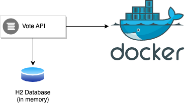
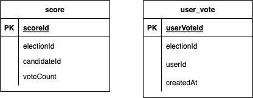

# vote-api
This is a rest api to send vote and show results for the election

## Objective
This repository provides an example for Hexagonal architecture

## Overview
There are some assumptions for the sake of simplicity
* Voter or user info is fetched from an external service and stubbed in the implementation
* Election info fetched from an external service and stubbed in the implementation
  * There are  elections registered
    * electionId: 1 (it is the valid and current election that is available for request)
    * electionId: 2 (it is an expired election)
* Event publishing not implemented
  * There are 2 events to be published
    * user voted event
    * notify user with the contact info
* Event listening not implemented

### High Level Design


### Database Design


### Tech Stack
* Java11
* Spring Boot
* Maven 3
* H2
* Docker

## Running the application locally ##
### How do I get set up? ###

* Summary of set up: Assuming that docker has already been installed in your local machine, 
just clone the repository into a folder than run the command below 

```` docker build -t vote-app-image . ````
```` docker run -d --name vote_app -p 9081:9081 vote-app-image:latest ````

#### Running by IDE
* Use your favorite IDE and hit the run button
* when the application is up and running, hit the url http://localhost:9081/swagger-ui/index.html to access the API documentation

### How to test the application
* How to run tests: to run tests, execute the command below

#### Unit and Integration tests
````./mvn test````

## Workarounds
- 
